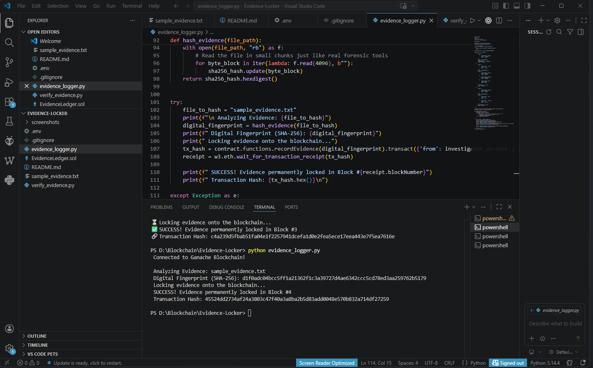
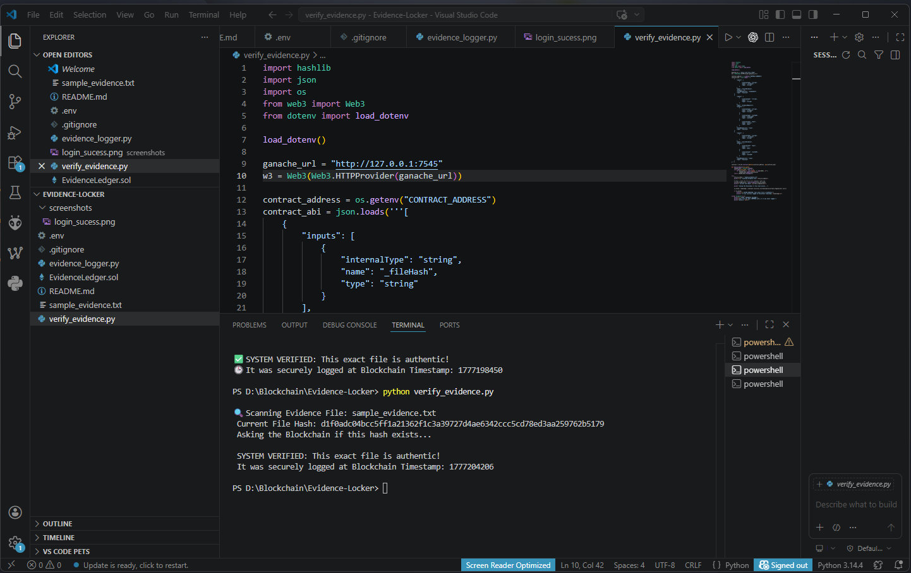
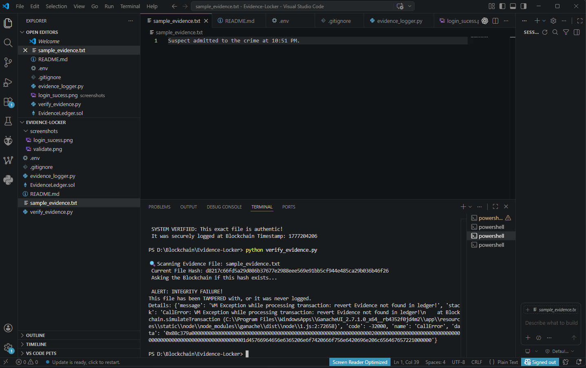

# Forensic-Ledger: Immutable Evidence Tracker 🛡️

**Author:** Krishan Sivaprakasham  
**Domain:** Digital Forensics & Blockchain Technology  
**Context:** Proof of Concept (Phase 1) for research on "Ensuring Digital Forensic Evidence Integrity."

## 📖 The Problem
In digital forensics, maintaining a secure "Chain of Custody" is paramount. Traditional methods of logging digital evidence (like disk images or chat logs) rely on centralized databases or paper forms. These are highly vulnerable to tampering, unauthorized edits, or administrative breaches. If a defense attorney can prove a file was altered post-seizure, the evidence is rendered inadmissible in court.

## 💡 The Solution
Forensic-Ledger utilizes a private Ethereum-based blockchain (Ganache) to act as an immutable digital notary for forensic investigators.

1. **Hashing:** The system generates a cryptographic SHA-256 fingerprint of the seized digital evidence.
2. **Immutability:** This hash is embedded into a Solidity Smart Contract and deployed to the blockchain. 
3. **Verification:** Any future investigator, auditor, or legal counsel can verify the evidence. If even a single byte of the file is altered, the hash will change, and the blockchain will immediately flag an **Integrity Failure**.

## 🛠️ Technology Stack
* **Blockchain Network:** Ganache (Local Ethereum Testnet)
* **Smart Contracts:** Solidity (Compiled via Remix IDE)
* **Backend Logic:** Python 3
* **Libraries:** `web3.py`, `hashlib`, `python-dotenv`

---

## 🚀 System Workflow & Demonstration

### 1. Logging Evidence (The Seizure)
The investigator runs `evidence_logger.py`. The script reads the target file, calculates its SHA-256 fingerprint, and securely locks it into a blockchain block with a permanent timestamp.

### 2. Verifying Evidence (The Audit)
Before presenting evidence in court, the legal team runs `verify_evidence.py` to check the file against the immutable blockchain ledger.

### 3. Catching Tampering (The Security Trigger)
If a malicious actor alters the text file (e.g., changing a timestamp, deleting a word, or modifying an image), the verification script detects the hash mismatch and fails instantly:

## 🎯 Conclusion & Future Scope

This Phase 1 Proof of Concept successfully demonstrates that integrating blockchain technology into digital forensics can mathematically guarantee the integrity of the Chain of Custody. By utilizing an immutable Smart Contract ledger, we completely eliminate the vulnerabilities and single points of failure inherent in traditional, centralized police databases. 

No single entity—neither the investigator, the system administrator, nor a malicious actor—can alter the forensic timeline without the blockchain instantly flagging the intrusion.

**Looking Ahead to Phase 2 (Decentralized Storage):**
While this current phase secures the *integrity* of the evidence (proving it hasn't changed), the physical file itself currently relies on local storage. In Phase 2, this architecture will be upgraded to integrate **IPFS (InterPlanetary File System)**. By pushing the actual evidence files into a decentralized P2P vault and locking the resulting IPFS CID onto the blockchain, this project will achieve a complete, end-to-end "Zero-Trust" forensic architecture.